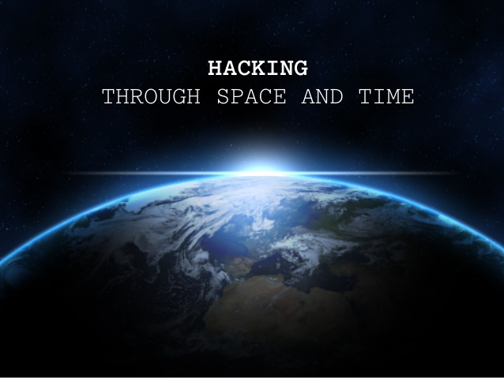

<!--
*** I'm using markdown "reference style" links for readability.
*** Reference links are enclosed in brackets [ ] instead of parentheses ( ).
*** See the bottom of this document for the declaration of the reference variables
*** for contributors-url, forks-url, etc. This is an optional, concise syntax you may use.
*** https://www.markdownguide.org/basic-syntax/#reference-style-links
-->

<!-- PROJECT LOGO -->
 

  

  <h3 align="center">Through Space and Time</h3>

  

    Project from NASA Space Apps Hackaton 2020
     
    <a href="https://github.com/fgtoralesch/throughspaceandtime"><strong>Explore the docs »</strong></a>
     
     
    <a href="https://github.com/fgtoralesch/throughspaceandtime">How to use it</a>
    ·
    <a href="https://github.com/fgtoralesch/throughspaceandtime/issues">Report Bug</a>
    ·
    <a href="https://github.com/fgtoralesch/throughspaceandtime/issues">Request Feature</a>
  

<!-- TABLE OF CONTENTS -->
## Table of Contents

- [Table of Contents](#table-of-contents)
- [About The Project](#about-the-project)
  - [Built with](#built-with)
- [Usage](#usage)
- [Roadmap](#roadmap)
- [Contributing](#contributing)
- [License](#license)
- [Acknowledgements](#acknowledgements)

<!-- ABOUT THE PROJECT -->
## About The Project

Wouldn't it be great if you could quickly see how climate and environmental changes are evolving in different locations through time? If this sounds like you, then you are on the right place. Using NASA's open source datasets and virtual globe API we provide a simple tool for looking around Earth in an instant. And it's not even 400 lines of code, so feel free to modify it to your taste to visualise what matters most to you!
[![Product Name Screen Shot][product-screenshot]](https://nasaspacetime.co/)

### Built with

* [JQuery](https://jquery.com/)
* [Web WorldWind](https://worldwind.arc.nasa.gov/)
* [NEO: Nasa Earth Observations](https://neo.sci.gsfc.nasa.gov/)

## Usage

Just spin around the globe by dragging it with the left mouse click or scrolling to get closer. The world is in your hands now!

[![Product Name Screen Shot][demo-gif]](https://nasaspacetime.co/)

<!-- ROADMAP -->
## Roadmap

See the [Project Board](https://github.com/fgtoralesch/throughspaceandtime/projects/1) for a list of proposed features (and known issues). 
The major aspects are: 
  -Add a searchbar for Locations, so you are able to find your the location you're intersted in faster. 
  -Add a searchbar for datasets, so you can find the data you need. 
  -Add a timeline for better visualistaion of changes between datasets. 
  -Improve the overal usibility and experience. 

<!-- CONTRIBUTING -->
## Contributing

Contributions are what make the open source community such an amazing place to be learn, inspire, and create. We specially started working in this project to let people know about the availabe data out there, but more importantly to encourage others to make it work in a weekend if they wanted to. So obviously any contributions you make are **greatly appreciated**.

1. Fork the Project
2. Create your Feature Branch (`git checkout -b feature/AmazingFeature`)
3. Commit your Changes (`git commit -m 'Add some AmazingFeature'`)
4. Push to the Branch (`git push origin feature/AmazingFeature`)
5. Open a Pull Request

<!-- LICENSE -->
## License

Distributed under the MIT License. See `LICENSE` for more information.

<!-- ACKNOWLEDGEMENTS -->
## Acknowledgements

* [NASA International Space Apps Challenge organisers](https://www.spaceappschallenge.org/)
* Everyone from the program who made this possible. Special mentions to Valentina (Berlin Team Lead) for encouraging us and keeping the morale up, as well as Miguel (one of the WorldWind creators) for volunteering his time and motivation to support us wiht his advice in the challenge.

<!-- MARKDOWN LINKS & IMAGES -->
<!-- https://www.markdownguide.org/basic-syntax/#reference-style-links -->
[contributors-shield]: https://img.shields.io/github/contributors/fgtoralesch/repo.svg?style=flat-square
[contributors-url]: https://github.com/fgtoralesch/repo/graphs/contributors
[forks-shield]: https://img.shields.io/github/forks/fgtoralesch/repo.svg?style=flat-square
[forks-url]: https://github.com/fgtoralesch/repo/network/members
[stars-shield]: https://img.shields.io/github/stars/fgtoralesch/repo.svg?style=flat-square
[stars-url]: https://github.com/fgtoralesch/repo/stargazers
[issues-shield]: https://img.shields.io/github/issues/fgtoralesch/repo.svg?style=flat-square
[issues-url]: https://github.com/fgtoralesch/repo/issues
[license-shield]: https://img.shields.io/github/license/fgtoralesch/repo.svg?style=flat-square
[license-url]: https://github.com/fgtoralesch/repo/blob/master/LICENSE.txt
[product-screenshot]: images/screenshot.png
[demo-gif]: images/showcase.gif
